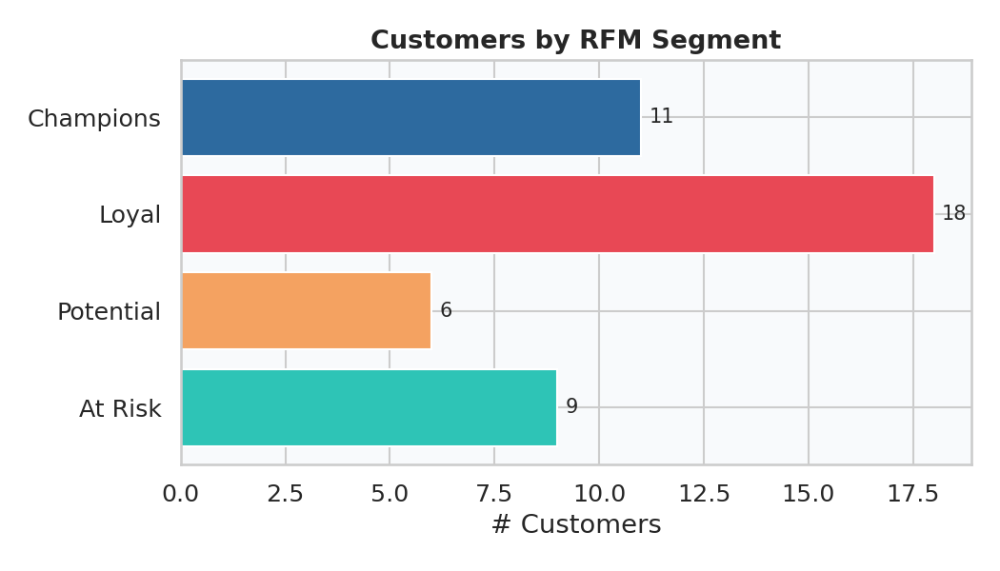
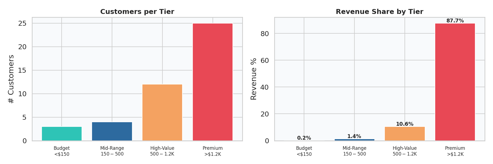

# E-Commerce Customer Analytics

**Tools:** Python (Pandas, Matplotlib, Seaborn) · SQL · Power BI

## Overview
End-to-end customer analytics pipeline analyzing purchase behavior,
repeat customers, lifetime value, and segmentation across 50 customers
and 300 transactions.

## Key Findings
- Identified high-value customer segments using RFM scoring.
- Measured customer lifetime value to understand long-term revenue contribution.
- Analyzed top-performing acquisition channels and regions.
- Evaluated repeat purchase behavior and revenue trends.

## Skills Demonstrated
- Customer Segmentation (RFM + Spend Tiers)
- Exploratory Data Analysis
- Data Visualization (8 chart types)
- SQL (CTEs, Window Functions, NTILE scoring)
- CLV Modeling

## Future Enhancements
- Power BI Dashboard
- Churn Prediction Model
- Cohort Analysis
- Revenue Forecasting
- 
## Project Structure
- `python/generate_data.py` — synthetic data generation
- `python/eda_analysis.py` — full EDA, CLV, RFM, segmentation
- `sql/analytics_queries.sql` — 8 production-ready SQL queries
- `outputs/` — generated charts and enriched CSVs

## How to Run
pip install pandas numpy matplotlib seaborn

## Note
Run `python python/generate_data.py` first to generate the dataset
before running the analysis script.

ls data/

python python/eda_analysis.py

